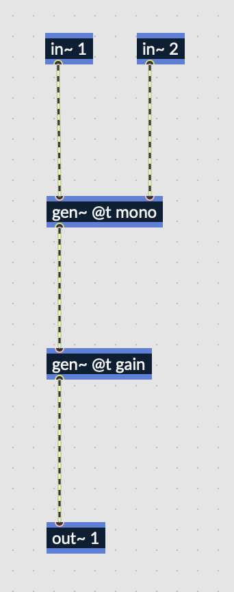
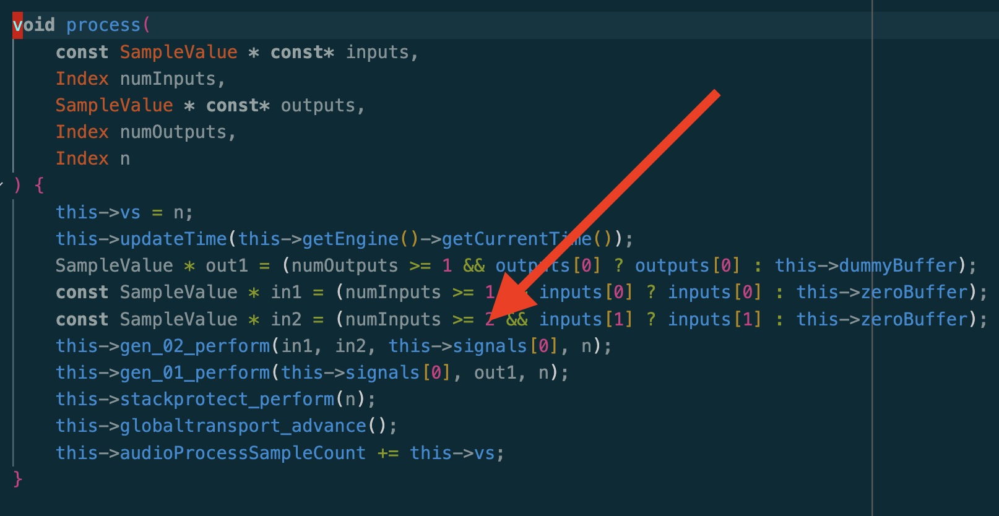
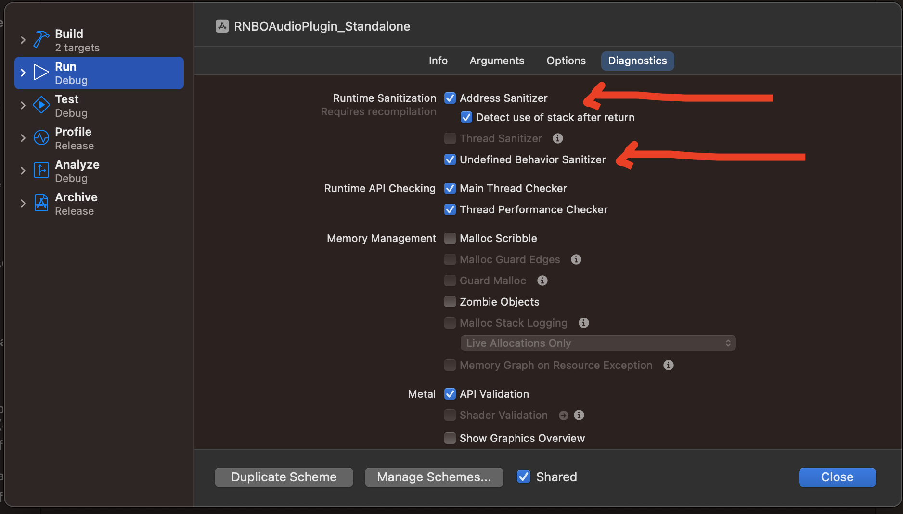

# rnbo-ios-bug

A patcher containing a "mono" gen + RNBO patch is on the root of this
repository.

This repository reproduces a bug and proposes a fix for iOS usage of RNBO
exported JUCE `AudioProcessor`s.

## Bug cause and minimal reproduction

In order for the bug to occur:

(some build set-up + bump JUCE to 7.0.5)

1. Create a patch with 2 gen objects chained one after the other
2. Export the code into the export directory of `rnbo.example.juce`
3. Open the exported application on an iOS device using AirPods
4. Buffer overflow issue will happen due to larger buffers passed than
   `blockSize`



When the code is exported, running it on iOS will lead to an issue when processing
`this->signals`:



The issue is due a buffer overflow, because on iOS when using bluetooth speakers
it seems larger buffers may be passed than initially negotiated.

## Build set-up

In order to set-up iOS targets the `rnbo.example.juce` example's is changed to:

* remove some plugin formats, add the standalone target
* remove the install sections
* add microphone usage description

```diff
commit e460eaf470495e553042b63e5d99f62868fdf048
Author: yamadapc <tacla.yamada@gmail.com>
Date:   Sun Jul 2 15:13:52 2023 +1000

    iOS plugin build setup

diff --git a/Plugin.cmake b/Plugin.cmake
index 65232d9..d2e74cd 100644
--- a/Plugin.cmake
+++ b/Plugin.cmake
@@ -1,8 +1,5 @@
 # build VST3 and Unity for all platforms, add AU on MacOS
-set(PLUGIN_FORMATS VST3 Unity)
-if (CMAKE_SYSTEM_NAME STREQUAL Darwin)
-  LIST(APPEND PLUGIN_FORMATS AU)
-endif()
+set(PLUGIN_FORMATS AU Standalone)
 
 # if you are building a VST2 or AAX plugin, CMake needs to be told where to find these SDKs on your
 # system. This setup should be done before calling `juce_add_plugin`.
@@ -30,6 +27,11 @@ juce_add_plugin(RNBOAudioPlugin
   PLUGIN_MANUFACTURER_CODE "Exmp"      # A four-character manufacturer id with at least one upper-case character
   PLUGIN_CODE "Rnb0"                   # A unique four-character plugin id with at least one upper-case character
   FORMATS ${PLUGIN_FORMATS}            # The formats to build. Other valid formats are: AAX Unity VST AU AUv3
+  MICROPHONE_PERMISSION_ENABLED true
+  BACKGROUND_AUDIO_ENABLED true
+  MICROPHONE_PERMISSION_TEXT "RNBO needs access to your microphone to work."
+  IPAD_SCREEN_ORIENTATIONS UIInterfaceOrientationPortrait UIInterfaceOrientationPortraitUpsideDown UIInterfaceOrientationLandscapeLeft UIInterfaceOrientationLandscapeRight
+  IPHONE_SCREEN_ORIENTATIONS UIInterfaceOrientationUnknown UIInterfaceOrientationLandscapeLeft UIInterfaceOrientationLandscapeRight UIInterfaceOrientationPortrait UIInterfaceOrientationPortraitUpsideDown
   PRODUCT_NAME "RNBO Plugin")          # The name of the final executable, which can differ from the target name
 
 # `juce_generate_juce_header` will create a JuceHeader.h for a given target, which will be generated
@@ -100,15 +102,3 @@ target_link_libraries(RNBOAudioPlugin
   juce::juce_recommended_lto_flags
   juce::juce_recommended_warning_flags
   )
-
-#TODO windows and linux
-if(APPLE)
-  install(
-    TARGETS RNBOAudioPlugin_VST3
-    DESTINATION ~/Library/Audio/Plug-Ins/VST3/
-    )
-  install(
-    TARGETS RNBOAudioPlugin_AU
-    DESTINATION ~/Library/Audio/Plug-Ins/Components/
-    )
-endif()

```

Generate the XCode project for building the iOS app with:

```bash
mkdir -p xcode-ios
cd ./xcode-ios
cmake -D CMAKE_BUILD_TYPE=Release -D CMAKE_SYSTEM_NAME=iOS -G Xcode ../
```

## XCode run set-up

We edit the scheme to enable some sanitizers:



## Running

Running the app leads to a crash in an unrelated location.

## Fix

A potential fix would be to split processing into chunks.

* store the estimated block size from prepare
* on each process call, break-up the block into chunks and process them one at a
  time

```cpp
void JuceAudioProcessor::processBlock (juce::AudioBuffer<float>& buffer, juce::MidiBuffer& midiMessages)
{
	float* const* writePointers = buffer.getArrayOfWritePointers();
	for (int i = 0; i < buffer.getNumChannels(); i += 1) {
		_temporaryChannelPointers[i] = writePointers[i];
	}
	auto numBlocks = std::ceil(static_cast<float> (buffer.getNumSamples()) / _expectedBlockSize);
	auto remainingSamples = buffer.getNumSamples();

	for (int chunkIndex = 0; chunkIndex < numBlocks; chunkIndex += 1) {
		int chunkOffset = chunkIndex * static_cast<int> (_expectedBlockSize);
		for (int channel = 0; channel < buffer.getNumChannels(); channel += 1) {
			_temporaryChannelPointers[channel] = writePointers[channel] + chunkOffset;
		}
		auto chunkSize = std::min(
			static_cast<int> (_expectedBlockSize),
			remainingSamples
		);
		float* const* chunkPointers = _temporaryChannelPointers.data();
		AudioBuffer<float> chunkBuffer(
			chunkPointers,
			buffer.getNumChannels(),
			chunkSize
		);

		auto samples = static_cast<Index>(chunkBuffer.getNumSamples());
		wrapProcess(samples, midiMessages, [this, samples, &chunkBuffer]() {
			_rnboObject.process(
				chunkBuffer.getArrayOfReadPointers(),
				static_cast<Index>(chunkBuffer.getNumChannels()),
				chunkBuffer.getArrayOfWritePointers(),
				static_cast<Index>(chunkBuffer.getNumChannels()),
				samples,
				&_midiInput,
				&_midiOutput
			);
		});

		if (chunkIndex == 0) midiMessages.clear();
		remainingSamples -= chunkSize;
	}
}
```

This fixes crashes that were previously happening, such as:

[crash](crash.png)
